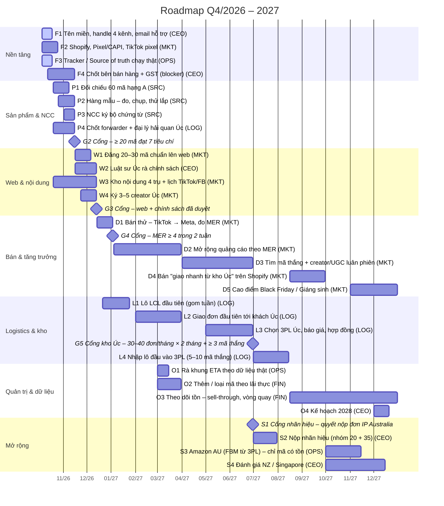

# Plan data – Roadmap, OKR & KPI targets

Thư mục này là **nguồn dữ liệu duy nhất** cho trang *Strategy, OKR & Roadmap* của handbook.
File này được tạo tự động bởi `tools/build_plan.py`: đừng sửa tay, hãy sửa CSV.

| File | Nội dung |
|---|---|
| `roadmap.csv` | Việc và cổng quyết định: workstream, chủ (role), ngày bắt đầu/kết thúc, trạng thái, phụ thuộc, điều kiện cổng |
| `objectives.csv` | Mục tiêu (Objective) cho từng tháng Q4/2026 và từng quý 2027 |
| `kpi_dictionary.csv` | Định nghĩa KPI: loại (North Star / kết quả / đòn bẩy / rào chắn), đơn vị, chiều, cách gộp, chủ, nguồn đo |
| `kpi_targets.csv` | Mục tiêu KPI theo kỳ (định dạng dài: kỳ × KPI × mục tiêu) |
| `orders_plan.csv` | Kế hoạch đơn hàng theo tháng: K01 và North Star được kiểm tra khớp với file này |
| `assumptions.csv` | Giả định: AOV, độ trễ giao, tỉ lệ giao trong khung, ngày lập kế hoạch |

**Chỉ có kế hoạch và mục tiêu.** Số thực tế (doanh thu, chi phí, đơn hàng) nằm trong Google Sheet nội bộ, không commit vào repo công khai này.

## Gantt



## Tổng theo năm (kế hoạch)

| Năm | Tổng đơn | Đơn/tháng cuối năm | Giao trong khung (NS1) | Doanh thu ước tính |
|---|---|---|---|---|
| 2026 | 8 | 8 | 0 | A$7,200 |
| 2027 | 570 | 110 | 333 | A$513,000 |

## Cập nhật

```bash
python tools/build_plan.py   # kiểm tra dữ liệu + tạo lại file này và SVG
python build.py              # build lại website
python tools/check_links.py  # phải báo 0 broken
```
